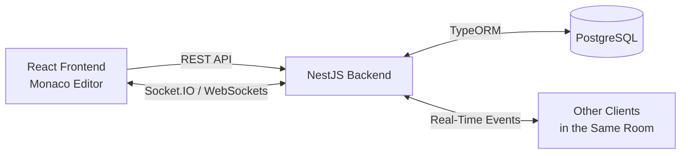

# Real-Time Collaborative Code Editor

A full-stack collaborative code editor that allows multiple users to join the same room and edit code together in real time. The application combines persistent document storage with WebSocket-based synchronization and live user presence.

## Live Demo

[Launch the Collaborative Code Editor](https://collaborative-code-editor-eix7.onrender.com)

## Features

- Real-time collaborative code editing across multiple clients
- Room-based collaboration using unique room IDs
- Live connected-user count
- Persistent documents stored in PostgreSQL
- Monaco Editor integration for a VS Code-like editing experience
- REST API for creating and retrieving documents
- WebSocket communication using Socket.IO
- Dockerized frontend, backend, and PostgreSQL environment
- Automated backend testing
- GitHub Actions continuous integration
- Public cloud deployment

## Tech Stack

| Layer | Technologies |
| --- | --- |
| Frontend | React, TypeScript, Vite, Monaco Editor |
| Backend | NestJS, TypeScript, Node.js |
| Real-Time Communication | Socket.IO, WebSockets |
| Database | PostgreSQL, TypeORM |
| Containerization | Docker, Docker Compose |
| Testing | Jest, ts-jest |
| CI/CD | GitHub Actions |
| Deployment | Render |

## Architecture

The application follows a client-server architecture with separate frontend, backend, and database layers.

- **React frontend** provides the user interface and Monaco-based code editor.
- **NestJS backend** exposes REST endpoints for document creation and retrieval.
- **Socket.IO** maintains persistent WebSocket connections for real-time code synchronization and user presence.
- **PostgreSQL** stores room documents so code persists across sessions and server restarts.
- **TypeORM** provides the persistence layer between NestJS and PostgreSQL.

### Communication Flow

1. A user creates or joins a room through the React frontend.
2. The frontend uses the REST API to create or retrieve the room's persisted document.
3. The client establishes a Socket.IO connection and joins the corresponding room.
4. Editor changes are sent to the backend through WebSocket events.
5. The backend persists the latest document content to PostgreSQL and broadcasts the change to other clients in the room.
6. Connected clients receive the update and synchronize their editors in real time.

### System Architecture



## Getting Started

### Prerequisites

Make sure the following are installed:

- Git
- Docker
- Docker Compose

### Run with Docker

1. Clone the repository:

```bash
git clone https://github.com/oussatem/collaborative-code-editor.git
cd collaborative-code-editor
```

2. Create a `.env` file in the project root:

```env
POSTGRES_USER=postgres
POSTGRES_PASSWORD=postgres
POSTGRES_DB=collaborative_code_editor
```

3. Build and start the application:

```bash
docker compose up --build
```

4. Open the application at:

```text
http://localhost:5173
```

The Docker Compose configuration starts the React frontend, NestJS backend, and PostgreSQL database together.

### Stop the Application

```bash
docker compose down
```

To stop the application and remove the PostgreSQL volume:

```bash
docker compose down -v
```

## Testing

The backend includes automated unit tests for the service, controller, and WebSocket gateway layers.

Run the backend test suite with:

```bash
cd backend
npm install
npm test
```

The current test suite includes **14 automated tests across 4 test suites**, covering document operations, API behavior, and real-time collaboration logic.

To generate a coverage report:

```bash
npm run test:cov
```

## CI/CD

GitHub Actions provides continuous integration for every push and pull request to `main`.

The CI pipeline automatically:

- Installs backend and frontend dependencies
- Runs the backend automated test suite
- Builds the NestJS backend
- Builds the React frontend

The production application is hosted on Render, with the frontend, backend, and PostgreSQL database deployed as separate services. Changes pushed to `main` can automatically trigger new deployments.

## Project Structure

```text
collaborative-code-editor/
├── .github/
│   └── workflows/
│       └── ci.yml
├── backend/
│   ├── src/
│   │   └── documents/
│   ├── Dockerfile
│   └── .env.example
├── frontend/
│   ├── src/
│   │   └── pages/
│   ├── Dockerfile
│   └── .env.example
├── docker-compose.yml
└── README.md
```

## Design Decisions

### Real-Time Synchronization

The editor uses a room-based Socket.IO architecture. Each collaborative document is associated with a unique room ID, and clients connected to the same room receive code updates and presence information in real time.

The current implementation synchronizes the complete document using a **last-write-wins** approach rather than a conflict-resolution algorithm such as Operational Transformation (OT) or a Conflict-free Replicated Data Type (CRDT).

This approach keeps the project focused on full-stack real-time communication, persistence, containerization, testing, and deployment while maintaining a clear path for more advanced synchronization in the future.

### Current Scope

The application is intentionally focused on the core collaborative editing workflow. Features such as authentication, multi-file workspaces, code execution, and advanced concurrent-edit conflict resolution are outside the current MVP scope.